# Bài tập lớn - Chat_app Android
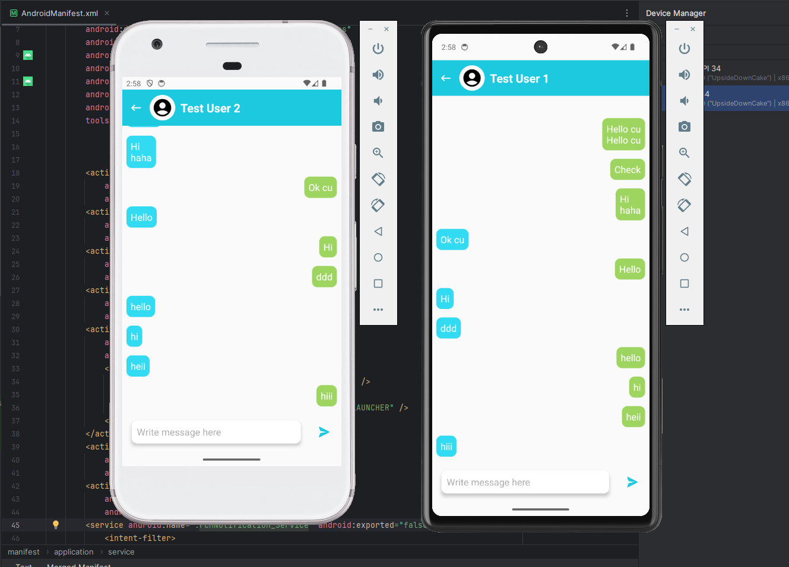

## Thành phần

#### AndroidStudio
Android, Java

#### Firebase
* Authentication
* Realtime Database
* Storage
* Cloud Messaging

## Tính năng

**Start:** Đăng nhập, tạo tài khoản qua số điện thoại

**Chats_view:** Danh sách tin nhắn, thay đổi theo thời gian thực

**Profile_view:** Thay đổi ảnh đại diện, đổi tên người dùng, đăng xuất

**Chat:** Gửi và hiển thị tin nhắn được phân loại theo timestamp

**Search:** Tìm bạn bè qua số điện thoại

**General:** Auto login, bottom navigation, error messages with snackbar, progress bar

## Giao diện - Screenshots

### Màn hình chờ | Nhập số điện thoại | Giao diện nhắn tin

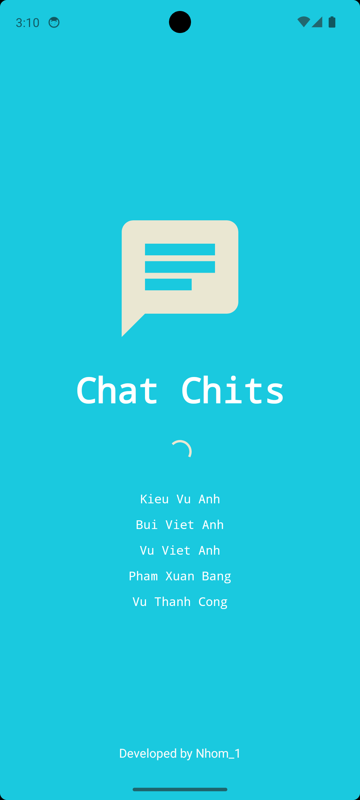
  |
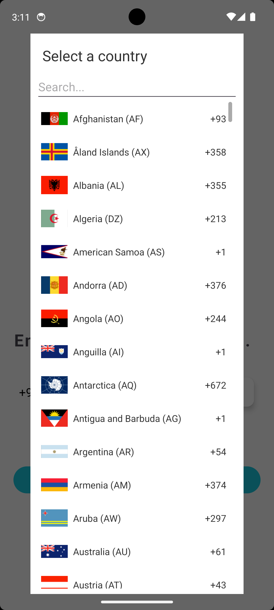 
  |
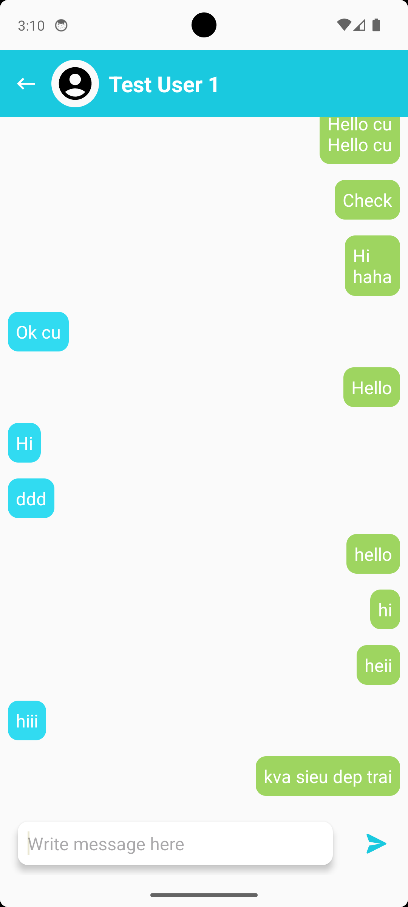 

### Thông báo tin nhắn trong nền
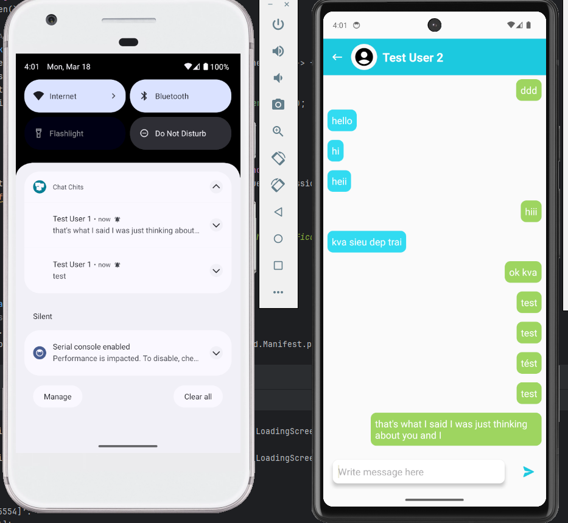

### Đăng nhập hoặc tạo tài khoản

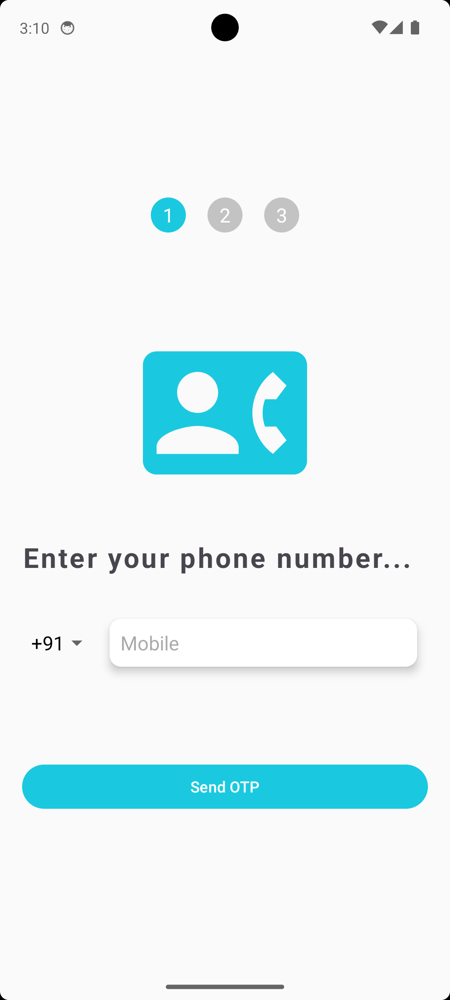 
  |
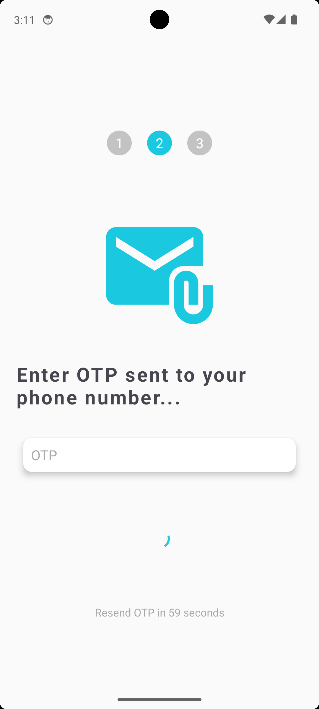 
  |
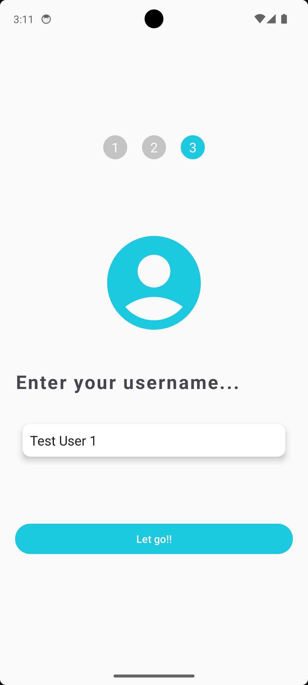

### Danh sách nhắn tin | Cài đặt profile | Tìm kiếm

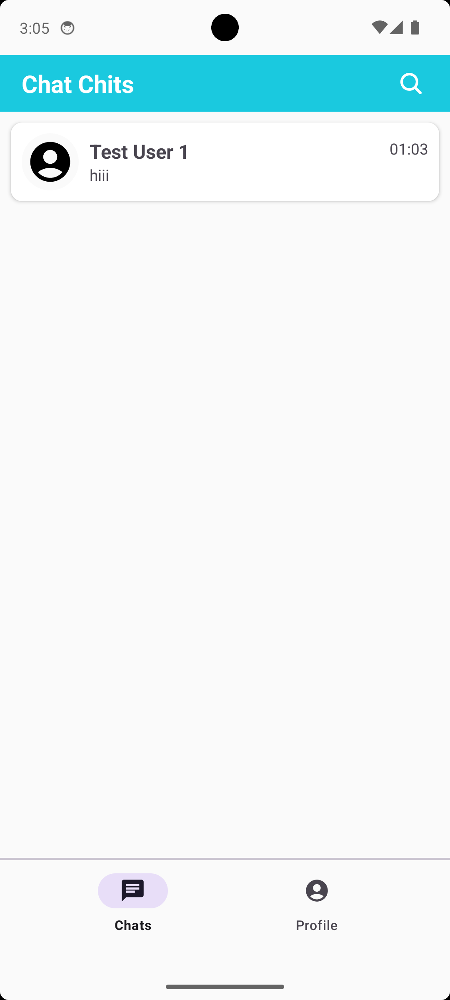 
  |
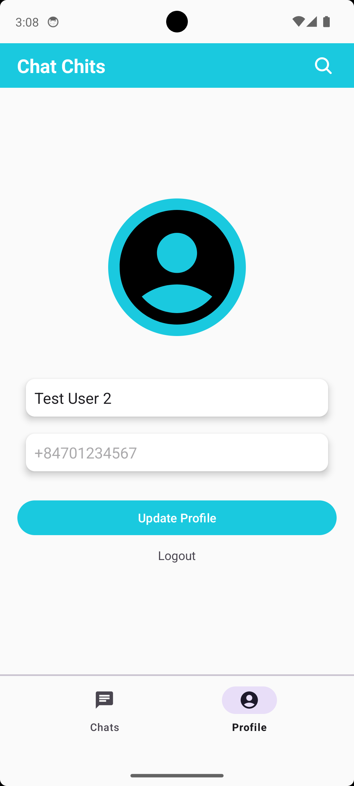 
  |
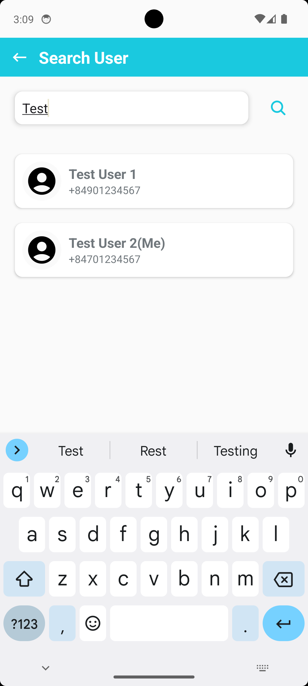 

